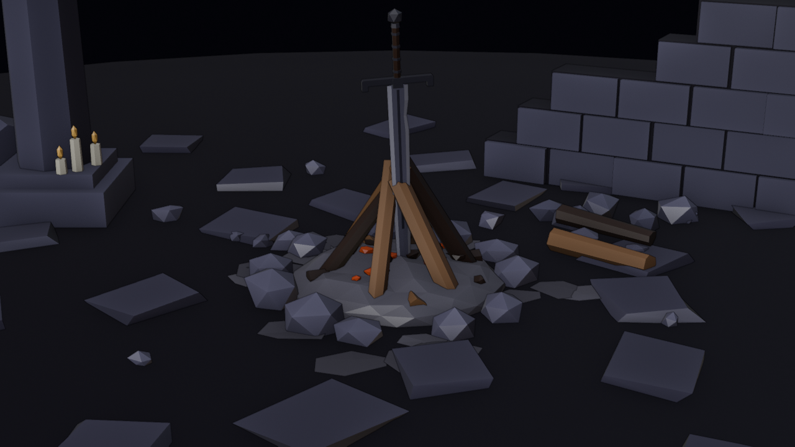

# Newton Hoang: Portfolio v2

**[nhoang.dev](https://nhoang.dev)** · a portfolio that plays like a game.



An always-visible, pixel-art bonfire burns behind every screen. The camera moves to a new
point of view for each one, projects live in an inventory, and inspecting one pulls the
weapon out of the fire and forges a new one, in a new color that recolors the whole page.
The same engine runs **[Bonfire Live](https://nhoang.dev/visualizer/)**, an audio-reactive
visualizer for DJ sets: it hears the beat, the build-ups and the drops, forges a blade in
the breakdown and slams it in on the drop.

Vite and plain JavaScript (type-checked through JSDoc), Three.js, a Blender-built model,
and a content admin on a Cloudflare Worker. Node 22.12 or later.

```bash
npm install
npm run dev        # the site: http://localhost:5173 (Bonfire Live at /visualizer/)
npm run check      # lint, type check, unit tests (site, visualizer, admin)
npm run e2e        # the production build in a real browser (Playwright)
npm run admin      # the admin panel, editing your local files: http://127.0.0.1:5175
npm run build      # outputs dist/
```

## How it's built

```
src/content.json ──► content.js ──► render.js (HTML) ──► main.js (routes, keys, the pack)
                                                         │
  tools/*.py (Blender) ──► public/models/bonfire.glb ──► bonfire/scene.js ◄── visualizer/director.js
                                                         │     ▲                 ▲
                                                         │     │                 └── analyser, tempo, sections
                                                         ▼     │
                                                  bonfire/frame.js  ──► pixelPass.js (dither, palette)
```

- **One scene, two front ends.** `src/bonfire/` is the engine: the fire, the three
  elements (fire, lightning, ice), the fireflies, the weapon forge, the impacts. The site
  drives it from the page (`src/main.js`); Bonfire Live drives it from the music
  (`src/visualizer/`). The visualizer's extra effects compile in only when it asks
  (`createBonfire({ effects: true })`), so the site ships a lean shader.
- **Pixel art from 3D.** Every frame is four low-resolution passes: normals, lit color,
  additive particles, then a pixel pass that draws outlines, orders a Bayer dither and
  snaps every pixel to the current flame's palette (`frame.js`, `pixelPass.js`).
- **Content is data.** All text, projects and effect settings live in `src/content.json`,
  checked by `src/contentRules.js`; the admin commits edits to this repo through a GitHub
  App, and every save redeploys.

## Things worth a look

| | Where |
| --- | --- |
| The weapon swap: a ripple dissolve, a helix of particles, the new blade forming, and each element's own take on it | `src/bonfire/weapons.js`, `forgeParticles.js`, `forgeFx.js` |
| Drop detection: kick-gone breakdowns, tension builds, a multi-cue drop score | `src/visualizer/sections.js`, `test/drops.test.mjs` |
| The living blade: procedural slashes, thrusts and spins on the beat | `src/bonfire/bladeMotion.js` |
| Fireflies that steer around the scenery and land on any surface | `src/bonfire/fireflies.js`, `terrain.js` |
| "How it's made": the page takes itself apart (press B on the site) | `src/ui/breakdown.js` |
| Palettes generated in OKLCH that keep text readable | `src/paletteGen.js` |

## Checks and deploys

Pushes to `main` deploy to GitHub Pages (`.github/workflows/deploy.yml`) only if the code
lints, type-checks, passes the unit tests and loads cleanly in a browser (`e2e/`: every
screen and Bonfire Live). Pull requests run the same checks (`checks.yml`). The admin is a
separate deploy: `npm run admin:deploy`.

## Docs

- [docs/bonfire.md](docs/bonfire.md): how the site and the scene behave, in detail
- [docs/bonfire-live.md](docs/bonfire-live.md): running Bonfire Live at a show
- [docs/admin.md](docs/admin.md): editing content, by hand or in the admin
- [docs/elements.md](docs/elements.md), [docs/visualizer.md](docs/visualizer.md),
  [docs/admin-v2.md](docs/admin-v2.md): design notes

## Accessibility and performance

Every screen works by keyboard (Q/E, arrows or WASD, Enter, Esc, I for the pack) and
announces its changes to screen readers. `prefers-reduced-motion` gets instant camera
cuts and a calmer, still-dithered fire. The scene renders at 3–4 CSS pixels a texel,
pauses in a hidden tab, and uses fewer particles and no shadows on touch devices;
Three.js loads after the page content, and fonts are served from the site itself.
